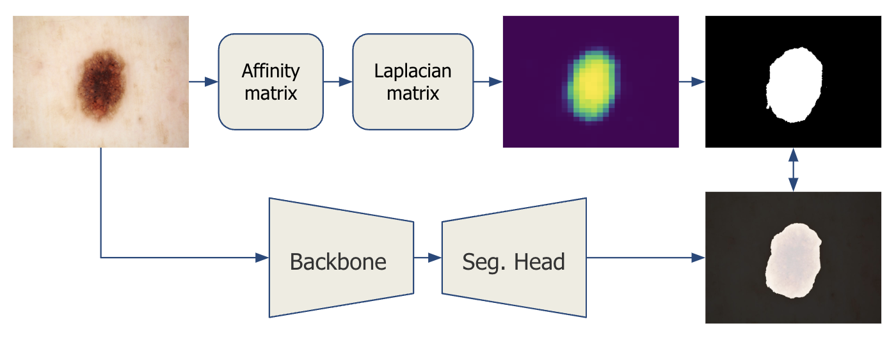
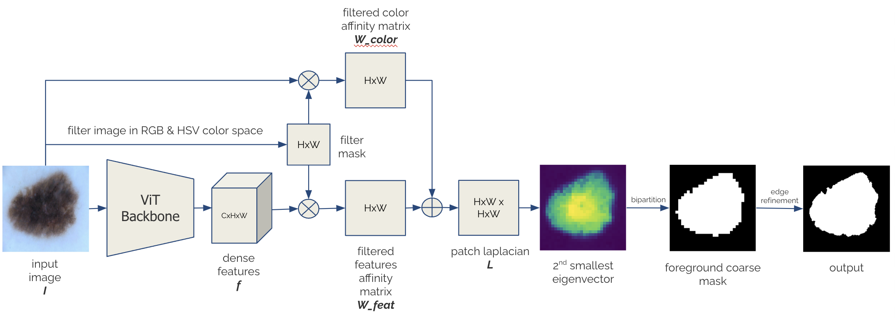
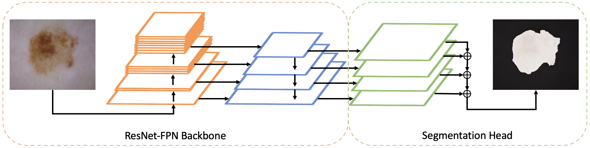

# Exploring Deep Spectral Methods for Unsupervised Skin Lesion Segmentation

Code release for unsupervised semantic segmentation on skin lesion datasets. 



# Contents
- [Setup](#setup)
- [Installation](#installation)
- [Method Overview](#method)
    - [Cutting Pipeline](#cutting-pipeline)
    - [Segmentation Pipeline](#segmentation-pipeline)


# Setup
Clone this repository:
```
git clone --recursive https://github.com/tibetakinci/cutseg.git
```

# Installation
Please visit the [Anaconda install page](https://docs.anaconda.com/anaconda/install/index.html) if you do not already have conda installed.

## Requirements
- Linux or macOS with Python ≥ 3.8
- PyTorch ≥ 1.8 and [torchvision](https://github.com/pytorch/vision/) that matches the PyTorch installation. 
Install them together at [pytorch.org](https://pytorch.org) to make sure of this
- OpenCV ≥ 4.6 is needed by demo and visualization
> Note: Please check PyTorch version matches that is required by Detectron2

## Conda environment example
```
conda create --name cutseg python=3.12 -y
conda activate cutseg
conda install pytorch==2.4.1 torchvision torchaudio -c pytorch

pip install -r requirements.txt
pip install git+https://github.com/lucasb-eyer/pydensecrf.git
pip install git+https://github.com/facebookresearch/detectron2.git
```

# Method
CutSeg method consists of two stages: 1) cutting image using deep spectral method and 2) learning segmentation head from pseudo-masks.

## Spectral Decomposition


Using deep spectral decomposition, we bipartition the image in order to provide segmentation mask for foreground object. The obtained object mask is then fed into the second stage of our pipeline.

### Generating Annotations
Please run the following code block to generate annotations in JSON file format.
```
cd cut
python cut.py \
    --vit-model dino --vit-arch base \
    --vit-feat k --patch-size 16 \
    --laplacian comb --fixed-size 480 \
    --imgs-path your_path_to_images \
    --out-dir path_to_output_annotation
```
- In order to run on CPU only, add ```--cpu``` parameter to the end

To display the complete list of parameters for [cut.py](cut/cut.py) with descriptions:
```
python cut.py --help
```

To run on cluster, please run the following code block:
```
sbatch tools/run_cut.sh
```

### Evaluate Masks
You can evaluate the bipartitioned masks with given ground truths by running this code block:
```
cd cut
python cut.py \
    --vit-model dino --vit-arch base \
    --vit-feat k --patch-size 16 \
    --laplacian comb --fixed-size 480 \
    --imgs-path your_path_to_images \
    --out-dir path_to_output_annotation \
    --gt-path your_path_to_gt \
    --eval
```

### Demo
To visualize the pseudo-mask produced by spectral decomposition, you can demo on single image with following code block:
```
cd maskcut
python demo.py --img-path imgs/demo2.jpg \
    --vit-model dino --vit-arch base \
    --vit-feat k --patch-size 16 \
    --laplacian comb --fixed-size 480 \
    --out-dir demo/
```
- In order to run on CPU only, add ```--cpu``` parameter to the end

## Semantic Segmentation


The semantic segmentation model is based on [Detectron2](https://detectron2.readthedocs.io/en/latest/index.html) library. The script ```train_net.py``` is provided to train and evaluate the model with given config file. All config files are located under [seg/model_zoo/configs](seg/model_zoo/configs/).

### Dataset Preperation
Before starting training, DETECTRON2_DATASETS environmental variable should be set to the directory including datasets by:
```
export DETECTRON2_DATASETS=/path/to/datasets/
```
If it is left unset, the default is ```./datasets``` relative to your current working directory. Datasets are defined in [builtin.py](seg/data/datasets/builtin.py). 

The structure of datasets should be as follows:
```
$DETECTRON2_DATASETS/
    isic16/
        train/
            imgs/
                {unique_name_0}.jpg
                {unique_name_1}.jpg
                {unique_name_2}.jpg
            annotation/
                ***.json
        test/
            imgs/
                {unique_name_0}.jpg
                {unique_name_1}.jpg
                {unique_name_2}.jpg
            label/
                {unique_name_0}.png
                {unique_name_1}.png
                {unique_name_2}.png
    isic18/
    ph2/
    7point/
    ...
```


### Model Learning
To train on our configuration file, please run following block:
```
cd seg
python train_net.py --num-gpus 1 \
    --config-file model_zoo/configs/cutseg-R50-FPN.yaml \
    --opts ...
```

> To run on cpu; add ```--opts MODEL.DEVICE cpu```

> To continue training; add ```--resume```

To run on cluster, please run the following code block:
```
sbatch tools/train_seg.sh
```

### Evaluate Model
To evaluate the model on test dataset, you can run the following block:
```
cd seg
python train_net.py
    --config-file model_zoo/configs/cutseg-R50-FPN.yaml \
    --test-dataset test/dataset/name
    --eval-only \
    --opts MODEL.WEIGHTS path/to/checkpoint
```

To run on cluster, please run the following code block:
```
sbatch tools/eval_seg.sh
```

### Demo
To visualize the results on given image(s), you can run the following block:
```
cd seg
python demo/demo.py 
    --config-file model_zoo/configs/cutseg-R50-FPN.yaml \
    --input demo/imgs/*.jpg \
    --opts MODEL.WEIGHTS path/to/checkpoint
```

To run on cluster, please run the following code block:
```
sbatch tools/demo_seg.sh
```
